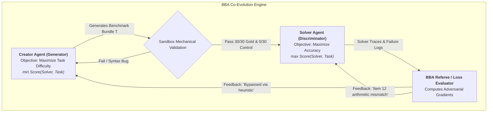

# BenchBenchAgent: Adversarial Benchmark Co-Evolution Framework

An autonomous, GAN-inspired framework where AI agents adversarially co-evolve to design, stress-test, and solve verifiable frontier benchmarks.

---

## 1. Executive Summary & Motivation

Traditional AI benchmarks suffer from rapid saturation, brittle grading, and high human authoring costs. **BenchBench** demonstrated that LLMs can author their own evaluation packages, but static one-shot generation results in high failure rates (broken seed handling, non-deterministic outputs, or trivial checklists).

**BenchBenchAgent (BBA)** is an autonomous, multi-agent adversarial optimization framework that treats benchmark generation and solving as a **minimax game** between two specialized agent roles:

1. **The Creator Agent (Generator / Adversary)**: Autonomously invents, compiles, and refines complex benchmark environments designed to push frontier models to their failure boundaries while maintaining provable mathematical/procedural solvability.
2. **The Solver Agent (Discriminator / Grunt)**: Programmatically explores the public solver bundles, writes bespoke Python parsing/execution scripts in a sandbox REPL, and solves items with high precision.
3. **The Referee & Optimizer Engine**: Evaluates the game state, enforces strict sandbox isolation, computes adversarial loss gradients, and feeds diagnostic traces back to both agents to drive continuous co-evolution.



---

## 2. Formal Game-Theoretic Formulation

The interaction is modeled as a constrained minimax game targeting the **Discriminative Frontier (the "Goldilocks Zone")**:

### Creator Objective ($G_\theta$)
$$\max_{T \in \mathcal{T}} \; \Big[ \mathcal{L}_{\text{difficulty}}(T, S) - \lambda_{\text{valid}} \cdot \mathcal{L}_{\text{invalidity}}(T) - \lambda_{\text{ambig}} \cdot \mathcal{L}_{\text{ambiguity}}(T) \Big]$$
* **Goal**: Minimize solver score $S(T)$, subject to $T$ passing $100\%$ deterministic verification ($30/30$ on gold, $0/30$ on negative control).
* **Search / Mutation**: Inspects solver execution logs to identify heuristics or shortcuts used by the solver, then mutates the rule engine, distractor noise, and edge cases to close those shortcuts.

### Solver Objective ($S_\phi$)
$$\max_{\pi \in \Pi} \; \mathbb{E}_{T \sim \mathcal{D}} \Big[ \text{Score}(S_\pi, T) \Big]$$
* **Goal**: Maximize score $S(T) \to 30/30$ using autonomous code execution, hypothesis testing, and tool use.
* **Search / Adaptation**: Upgrades parsing scripts, self-consistency checks, and arithmetic precision based on verification failures.

### Target Equilibrium Matrix

| Solver Score | Status | Referee Action |
| :--- | :--- | :--- |
| **$25/30 - 30/30$** | **Trivial Failure** | Penalizes Creator. Creator must introduce higher-order reasoning, non-standard schemas, or deeper dependency chains. |
| **$0/30$ (Ambiguity)** | **Unsolvable Failure** | Penalizes Creator. Creator must fix public rule specifications or eliminate hidden state dependencies ($P=NP$ penalty). |
| **$10/30 - 18/30$** | **Optimal Frontier** | **Success Equilibrium**. Validates that the benchmark effectively discriminates true reasoning from heuristic pattern-matching. |

---

## 3. System Architecture & Components

### 3.1 The Creator Pipeline (`BenchBench-Creator-Agent`)
* **Domain Synthesizer**: Formulates problem domains with deterministic ground truth (e.g. freight tariff reconciliation, distributed consensus log recovery, enterprise tax compliance).
* **Code Compiler**: Emits `generator.py`, `verifier.py`, `scorer.py`, `benchmark_spec.json`, and `SOLVER_MANIFEST.json`.
* **Autonomous Preflight Sandbox**:
  * Runs `generator.py --seed 42` twice to verify bit-for-bit output digest invariance.
  * Validates that `gold_private_sample.jsonl` self-scores $30/30$.
  * Validates that shifted wrong baseline scores exactly $0/30$.
  * Self-repairs compiler errors and schema violations before releasing the bundle.

### 3.2 The Solver Pipeline (`BenchBench-Solver-Agent`)
* **Bundle Ingestion**: Recursively reads `SOLVER_MANIFEST.json`, `solver_packet.md`, and raw item assets.
* **REPL Execution Sandbox**: Writes and executes isolated Python scripts to parse tables, extract metadata, and execute Decimal half-up arithmetic.
* **Contract Verifier**: Formats and validates predictions strictly against `{"id": "...", "answer": "..."}` JSONL contracts.

### 3.3 The Referee & Harness Engine
* **Isolation Sandbox**: Guarantees zero leakage of private gold or generator source code to solver processes.
* **Diagnostic Trace Extractor**: Analyzes solver execution logs (token consumption, bash commands, error traces).
* **Prompt Gradient Generator**: Translates solver execution traces into actionable natural-language feedback for the next generator iteration.

---

## 4. Benchmark Package Contract

Every generated benchmark package conforms to the following strict directory layout:

```
benchmark_candidate/
├── README.md                     # Domain description and problem framing
├── benchmark_spec.json           # Schema version, domain tags, item counts
├── generator.py                  # Deterministic synthetic data generator
├── verifier.py                   # Automated solvability & constraint checker
├── scorer.py                     # Deterministic grader (Decimal half-up)
├── gold_private_sample.jsonl     # Private ground truth ({"id": "...", "answer": ...})
├── validation_report.md          # Solvability argument & evidence proof
├── failure_modes.md              # Predicted model failure modes
└── solver_bundle/                # Isolated public bundle given to solvers
    ├── SOLVER_MANIFEST.json      # File manifests and asset digests
    ├── items_private_sample.jsonl# Public problem item descriptions
    ├── solver_packet.md          # Public rules and domain instructions
    └── assets/                   # Raw multi-file evidence (receipts, XML, logs)
```

---

## 5. Execution Protocol & Iteration Cycle

```
Round t:
  1. Creator Agent generates candidate package T_t.
  2. Sandbox Controller runs mechanical preflight:
     - Digest invariance check (Seed 42 x 2)
     - Gold verification (Assert Score == 30/30)
     - Negative control verification (Assert Score == 0/30)
  3. Solver Agent receives solver_bundle/ and executes in isolated REPL sandbox.
  4. Scorer evaluates predictions -> outputs Score S_t.
  5. Referee evaluates (T_t, S_t):
     - If S_t > 24: Generate Hardening Feedback -> Creator evolves T_{t+1}.
     - If S_t < 5 & Unsolvable: Generate Clarification Feedback -> Creator refactors T_{t+1}.
     - If 10 <= S_t <= 18: Promote to Canonical Benchmark Registry.
```

---

## 6. Roadmap & Implementation Phases

- [x] **Phase 0: Foundation**: Ingest and audit upstream `benchbench` mechanics and experiment registries.
- [ ] **Phase 1: Self-Repairing Creator Agent**: Build the autonomous sandbox compilation and preflight self-healing loop for benchmark packages.
- [ ] **Phase 2: Tool-Augmented Forensic Solver**: Build the REPL-assisted solver agent with structured item iteration and Decimal arithmetic verification.
- [ ] **Phase 3: Adversarial Co-Evolution Loop**: Connect Creator and Solver into a closed feedback loop with automated trace diagnostics.
- [ ] **Phase 4: RLVR Integration**: Export converged benchmark environments as Reinforcement Learning with Verifiable Rewards (RLVR) datasets for model post-training.

---

## Acknowledgements

This project builds upon and draws inspiration from:
- [**Introducing BenchBench** by Rohit Krishnan (*Strange Loop Canon*)](https://www.strangeloopcanon.com/p/introducing-benchbench) — for the foundational concept of testing models on their ability to create benchmarks for each other.
- [**BenchBenchBench** by Ethan Mollick (`emollick/benchbenchbench`)](https://github.com/emollick/benchbenchbench) — for pioneering recursive meta-evaluation audits and holdout conformance testing of AI benchmark generators.
