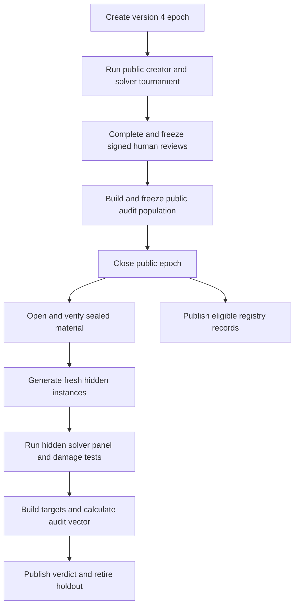

# BBA completion plan

This plan closes each gap in the [implementation status](implementation-status.md).
It applies to BBA version `0.7.0` and protocol `bba.epoch.v3`.
The work will create protocol `bba.epoch.v4` and a new evidence schema.
BBA will not convert a version 3 epoch to version 4.

The protocol specification remains the normative source.
Update the protocol before code changes implement a new rule.

## Product limits

The completed system must obey these limits:

- BBA runs the controller, state store, evidence store, sandbox, scoring, and audit on the local computer.
- BBA uses Google Cloud only for serverless model inference.
- Google Python ADK controls each model session.
- BBA does not deploy a model endpoint or another cloud service.
- BBA owns the model catalog, prompts, behavior settings, budgets, and audit policy.
- The operator supplies Google Cloud access and starts the epoch.
- An independent human reviewer supplies a signed review when promotion is required.
- Generated benchmark code has no network access and no access to Google Cloud credentials.
- Public and hidden scores come from stored evidence. The operator does not supply score files.

## Protocol decisions

Freeze these decisions in protocol version 4 before other implementation work starts.

1. An incomplete creator row has a published status but has no rank. Its `rank` value is null. BBA excludes it from official creator and solver aggregates.
2. BBA retries only `timeout` and `provider_error` results. The frozen policy permits three attempts. BBA does not retry a parse error, partial prediction, scorer error, invalid bundle, or successful attempt.
3. Every attempt is immutable. The first successful attempt is the selected attempt. If no attempt succeeds, the final retryable attempt is the selected non-score state.
4. A non-success state never has a numeric score. A retry does not change old evidence.
5. Promotion records use Ed25519 signatures. The evidence contains the reviewer public key ID. It does not contain the reviewer private key.
6. A benchmark can use the Python standard library or a package from a BBA-owned local wheel catalog. Candidate code cannot download a dependency.
7. A sandbox control is mandatory when the protocol claims that control. BBA stops if the local computer cannot apply the control.
8. The hidden panel uses provider-qualified model and scaffold configurations that are not in the public panel. All model calls still use serverless Vertex AI through ADK.
9. A revealed holdout cannot be used by a later epoch.
10. The sealed audit command accepts an epoch ID. It does not accept public or hidden score files.

## Target flow

Each stage writes immutable evidence before it marks local work as complete.
The resume command uses that evidence as the source of truth.

## Milestone 0: Freeze version 4 contracts

### Implementation

- Update `docs/protocol.md` with the ten protocol decisions in this plan.
- Add version 4 types to `bba/protocol.py`.
- Add an immutable `SolverAttempt` contract.
- Change `SolverCell` to contain attempt references and one selected attempt reference.
- Add structured contracts for reviewer findings, evaluator identity, hidden solver identity, dependency environment, and holdout retirement.
- Define the composite and hidden-only target formulas in the protocol.
- Define all audit component weights and decision thresholds in the manifest.
- Remove the version 3 manual-score audit command from the version 4 CLI.
- Make a version mismatch stop with a clear error.

### Verification

- Add round-trip tests for each version 4 record.
- Add tests that reject an unknown field, a missing field, a bad digest, and a wrong schema version.
- Add tests for all invalid `SolverAttempt` and `SolverCell` state combinations.
- Add a test that proves a version 3 epoch cannot run with a version 4 controller.
- Add a test that checks the protocol version in the package, CLI, manifest, and documents.

### Exit gate

The protocol and schema have no open policy conflict.
All later milestones use only the version 4 contracts.

## Milestone 1: Preserve and replay solver evidence

This milestone closes status item 3.

### Implementation

- Copy solver outputs from the temporary workspace before that workspace closes.
- Store the exact prediction file, candidate scorer report, controller scorer report, command result, stdout diagnostics, and stderr diagnostics.
- Store each file under a content digest.
- Bind all artifact digests to one `SolverAttempt` record.
- Keep creator-authored diagnostics private from the public feedback view.
- Add `bba evidence replay-cell`.
- Make replay use the frozen benchmark instance and dependency environment.
- Make replay compare the new controller score report with the stored report.

### Verification

- Replay each successful cell in an end-to-end fixture without a model call.
- Check that replay produces the same total, correct count, accuracy, and per-item result.
- Change one stored prediction byte and confirm that digest verification fails.
- Change the scorer or instance and confirm that replay fails.
- Confirm that a temporary workspace can be deleted without loss of replay data.
- Confirm that public feedback cannot read private scorer diagnostics.

### Exit gate

Every successful score can be independently reproduced from immutable local evidence.

## Milestone 2: Add attempts, retries, and correct ranking

This milestone closes status items 4 and 5.

### Implementation

- Create a stable cell ID from the snapshot, instance, solver identity, and repetition.
- Create a stable attempt ID from the cell ID and attempt number.
- Store an attempt before the controller decides if another attempt is allowed.
- Apply the frozen retry policy from the manifest.
- Use local state transactions to claim one attempt at a time.
- Resume at the next allowed attempt after an interruption.
- Stop all work for a cell after its first success.
- Publish every incomplete row with `rank: null`.
- Exclude incomplete rows from creator order and solver macro-averages.
- Keep incomplete rows in the matrix and status output.

### Verification

- Inject two provider failures and one success. Confirm that BBA selects the success and keeps all three attempts.
- Inject three provider failures. Confirm that the cell remains `provider_error` and has no score.
- Inject parse, partial, scorer, and invalid-bundle errors. Confirm that BBA does not retry them.
- Stop the process after an attempt is stored but before state success. Confirm that resume does not overwrite or duplicate it.
- Try to run a fourth attempt and confirm that BBA rejects it.
- Confirm that a genuine zero score is different from each non-success state.
- Confirm that one incomplete cell makes the creator row unranked.
- Confirm that an incomplete row does not affect the solver aggregate.

### Exit gate

Failure, retry, resume, and ranking have one deterministic result for the same frozen evidence.

## Milestone 3: Complete the human promotion gate

This milestone closes status item 6.

### Implementation

- Add explicit reviewer fields for the named capability, public solvability, oracle consistency, scorer consistency, arbitrary obscurity, and evaluation usefulness.
- Store the six reconstructed answers and their item IDs.
- Check mechanical validity, panel completeness, final-round status, and review answers inside the promotion method.
- Require a second signed review when the first reviewer reports a discrepancy.
- Add Ed25519 signing and verification.
- Store the reviewer key ID and public key in a local reviewer trust registry.
- Bind the review to the candidate digest, instance digest, evidence digests, evaluator identity, decision, limits, and time.
- Publish rejected and escalated decisions as historical evidence.
- Publish only an eligible approved decision to the canonical registry after public closure.
- Do not make canonical promotion depend on hidden evidence.

### Verification

- Test each promotion condition as a separate negative case.
- Confirm that one wrong reconstructed answer blocks approval.
- Confirm that a discrepancy requires a different second reviewer key.
- Confirm that a changed review record makes signature verification fail.
- Confirm that a missing or untrusted public key blocks promotion.
- Confirm that two processes cannot append conflicting records for the same candidate.
- Confirm that a valid independent signature can be checked without the reviewer private key.

### Exit gate

No code path can publish a canonical record without all mechanical, solver, human, and signature checks.
Canonical publication does not expose or use sealed audit evidence.

## Expected code areas

Use small modules with one owner for each evidence rule.

| Area | Existing or new code |
| --- | --- |
| Version 4 records | Update `bba/protocol.py` and record parsers. |
| Immutable artifacts and replay | Update `bba/evidence.py`; add `bba/replay.py`. |
| Attempts, retry, resume, and rank | Update `bba/state.py`, `bba/tournament.py`, and `bba/scoring.py`. |
| Human review and trust | Update `bba/registry.py`; add `bba/review.py`. |
| Offline dependencies | Add `bba/dependencies.py`; update `bba/validator.py`. |
| Sandbox controls | Update `bba/runtime.py`; add security probes under `tests/security/`. |
| Evaluator identity and holdouts | Add `bba/evaluator_identity.py` and `bba/holdouts.py`. |
| Sealed execution | Add `bba/audit_runner.py`; update `bba/audit.py`, `bba/damage.py`, and `bba/epoch_setup.py`. |
| Live model proof | Add `bba/preflight.py`; update `bba/catalog.py` and `bba/adk_runtime.py`. |
| Cost and scheduling | Add `bba/budget.py` and `bba/scheduler.py`. |
| Operator commands | Update `bba/cli.py` and `docs/operations.md`. |
| Automated checks | Add focused test modules and `.github/workflows/`. |

## Milestone 4: Isolate dependencies and complete sandbox controls

This milestone closes status items 7 and 8.

### Implementation

- Create a versioned local wheel catalog with an allowlist and SHA-256 digest for each wheel.
- Accept wheels only. Do not accept a source archive or an install script.
- Require exact versions and hashes in `requirements.lock`.
- Build one isolated environment with `--no-index`, `--only-binary`, `--require-hashes`, and `--no-deps` behavior.
- Bind the wheel catalog, lock file, installed files, and interpreter to one environment digest.
- Use the same environment for validation, solving, and replay.
- Remove Google Cloud and credential variables from generated-code environments.
- Use a temporary home and temporary directory for each sandbox run.
- Deny network, credential paths, the evidence root, hidden files, other candidates, and unrelated host files.
- Add explicit CPU, memory, process, and wall-clock limits.
- Start generated work in a process group and terminate the complete group on timeout.
- Add a sandbox capability probe. Stop before an epoch if a mandatory control is not available.
- Make the protocol list only controls that the supported backend can enforce.

### Verification

- Install an approved test wheel offline and use it in generation, validation, and replay.
- Reject an unlisted wheel, wrong hash, transitive dependency, source archive, and network install.
- Test read and metadata access for each protected path class.
- Test DNS, loopback, and external socket access.
- Test access to ADC files and credential environment variables.
- Test writes outside the workspace, temporary home, and temporary directory.
- Test process, memory, CPU, and wall-clock exhaustion.
- Start a child and grandchild process. Confirm that timeout terminates both.
- Disable each required host capability in a fixture. Confirm that BBA stops before generated code runs.
- Run the security suite on every supported operating-system version.

### Exit gate

Every sandbox claim in the protocol has a passing executable test.
Validation and replay use the same digest-bound offline environment.

## Milestone 5: Bind the evaluator and retire holdouts

This milestone closes status items 9 and 10.

### Implementation

- Build an `EvaluatorIdentity` from the controller source, protocol rules, prompt templates, scoring code, validation code, audit policy, Python version, and frozen dependency lock.
- Store both the component digests and one root digest.
- Bind each public record and audit record to this identity.
- Require a new evaluator identity and a new sealed target after any bound component changes.
- Add a local append-only holdout registry.
- Give each holdout the states `committed`, `opened`, and `retired`.
- Lock registry changes across local epochs.
- Reject an epoch when its commitment already exists in the registry.
- Reject audit work when a commitment is retired or does not match the private material.
- Retire the holdout in the same durable operation that publishes the audit verdict.

### Verification

- Change each bound component in turn and confirm that the evaluator digest changes.
- Change an unrelated document and confirm that the evaluator digest does not change.
- Copy an old private plan to a new epoch and confirm that creation fails.
- Interrupt the process during audit publication. Confirm that resume produces one verdict and one retirement record.
- Try to audit a retired holdout and confirm that BBA rejects it.
- Check the full registry chain and detect deletion, reordering, or modification.

### Exit gate

Each score identifies the exact evaluator that made it.
No revealed holdout can become a sealed target again.

## Milestone 6: Run the sealed audit automatically

This milestone closes status items 1 and 2.

### Implementation

- Add a BBA-owned hidden solver catalog.
- Give each hidden identity a model route, scaffold digest, behavior settings, budget, seed policy, and tool contract.
- Keep hidden configurations and seeds outside creator workspaces and public feedback.
- Commit their digests when BBA creates the epoch.
- Build public base profiles, matched damage profiles, and the public-optimizer control after public solver work ends.
- Calculate their public evaluator scores from stored evidence.
- Freeze the complete public audit population before public closure.
- Do not accept a public audit score file from the operator.
- Freeze the signed reviewer records and then close the public epoch.
- Open private material only after the public epoch is closed.
- Verify each opened value against its manifest commitment.
- Generate fresh instances from the frozen designs and hidden seeds.
- Validate the fresh instances with the frozen evaluator and dependency environment.
- Run the hidden panel through ADK and serverless Vertex AI.
- Store hidden attempts with the same evidence contract as public attempts.
- Include matched tests for corrupt keys, duplicate items, truncation, answer leakage, and no-op generation.
- Derive public, composite, and hidden-only targets from evidence with the frozen target formula.
- Calculate Spearman agreement, global pairwise accuracy, shortlist pairwise accuracy, gap-stratified accuracy, exact defect sensitivity, top-k regret, utility recovery, and set recovery.
- Publish each component and the convenience summary.
- Compare the components with the preregistered thresholds.
- Mark the evaluator `validated` or `unvalidated`.
- Retire all revealed hidden material.
- Replace the manual audit CLI with `bba epoch audit --epoch-id EPOCH_ID --evidence-root PATH`.

### Verification

- Run a local fixture with at least four creators, three families, three rounds, fresh hidden seeds, and a distinct hidden scaffold panel.
- Confirm that a hidden instance differs from the public instance and is reproducible from the same hidden seed.
- Confirm that each hidden run binds its identity, prompt, settings, budget, predictions, score, and trace.
- Confirm that BBA detects each matched defect.
- Confirm that the public-optimizer control ranks well on public evidence and poorly on hidden evidence.
- Confirm that the audit exposes the selection gap for that control.
- Confirm that BBA derives and freezes all public profile scores before closure.
- Try to open hidden material before public closure and confirm that BBA rejects it.
- Change one private value and confirm that commitment verification fails.
- Search all creator feedback and public records for hidden values and confirm that no value appears.
- Run the command without score files and confirm that it produces both targets and the complete metric vector.
- Miss one audit threshold and confirm that BBA preserves the public run but marks the evaluator `unvalidated`.

### Exit gate

One command performs the sealed experiment from committed local material.
No operator-created score file is part of the audit.

## Milestone 7: Verify live models and freeze behavior

This milestone closes status items 11 and 12.

### Implementation

- Replace `provider-default` with explicit supported behavior settings in the source catalog.
- Record a structured `unsupported` value when Vertex AI does not expose a setting.
- Pass each supported setting through ADK.
- Record the effective request settings in every invocation trace.
- Add a small preflight tool call for every public and hidden catalog identity.
- Check access, serverless `global` routing, accepted terms, quota, function calling, token metadata, and response model identity.
- Make preflight use a small fixed call and token budget.
- Do not deploy an endpoint.
- Save a preflight record that is bound to the project, catalog digest, settings, and time.
- Make a paid epoch stop before creator work if the required preflight is absent or failed.

### Verification

- Use fake ADK models to test every preflight failure state.
- Confirm that the request uses Vertex AI mode and the `global` location.
- Confirm that no direct provider key or direct provider URL is accepted.
- Confirm that missing token metadata or a wrong response identity fails preflight.
- Run the explicit paid smoke job against every catalog model.
- Store the redacted request, response metadata, usage data, route identity, and verdict.

### Exit gate

Every catalog route has a recent passing live record for the configured Google Cloud project.
Every supported behavior setting is fixed and visible in evidence.

## Milestone 8: Add cost limits and bounded local concurrency

This milestone closes status items 14 and 15.

### Implementation

- Add a versioned local price catalog with an effective date and source reference.
- Calculate public and hidden invocation counts before an epoch starts.
- Show the expected token range and estimated serverless inference cost.
- Add BBA-owned epoch limits for calls, input tokens, output tokens, and estimated cost.
- Reserve budget before each model call and reconcile it after usage metadata arrives.
- Stop new work before the next call can exceed a hard limit.
- Store all reservations and reconciliations in local state.
- Add a bounded local work scheduler.
- Use a global worker limit and a per-publisher limit.
- Keep creator-round barriers and public-before-hidden barriers.
- Use stable work IDs and a deterministic ready-work order.
- Keep evidence publication and budget reservation transactional.
- Make sequential mode available as the reference mode.

### Verification

- Compare the estimate with fixture usage and with the final stored total.
- Simulate a price-catalog change and confirm that the epoch keeps its frozen catalog.
- Reach each hard limit and confirm that BBA starts no extra model call.
- Interrupt work after budget reservation. Confirm that resume does not spend the budget twice.
- Run the same fixture in sequential and concurrent modes.
- Compare all normalized evidence except time and scheduling metadata.
- Run concurrent resume tests with duplicate claims and process interruption.
- Confirm that no solver starts before its design and instance are frozen.
- Confirm that no hidden work starts before public closure.

### Exit gate

BBA cannot exceed its frozen call and token limits.
Concurrency changes run time but does not change cell identity, score, rank, or audit result.

## Milestone 9: Add continuous integration

This milestone closes status item 16.

### Implementation

- Add an unprivileged CI workflow for compilation, unit tests, schema tests, replay tests, integration fixtures, and `git diff --check`.
- Add a macOS job for the Seatbelt security suite.
- Add a package-build and clean-install job.
- Keep credentials out of all normal CI jobs.
- Add a separate manual paid workflow for live Vertex smoke tests.
- Use Google Cloud workload identity for the paid job. Do not store a long-lived service-account key.
- Save test reports and redacted smoke evidence as workflow artifacts.

### Verification

- Open a test change that breaks compilation, schema validation, replay, sandbox isolation, and formatting. Confirm that each correct job fails.
- Confirm that normal pull-request jobs cannot access Google Cloud credentials.
- Confirm that the paid job cannot start without manual approval and the protected environment.
- Confirm that a clean checkout can build, install, and run the local fixture suite.

### Exit gate

Each code change receives automatic local-protocol checks.
Live inference remains a separate and explicit paid action.

## Milestone 10: Run production acceptance

This milestone closes status item 13 and proves the complete system.

### Implementation sequence

1. Freeze the release source, dependency lock, price catalog, model catalog, prompts, and evaluator identity.
2. Run the paid preflight for every public and hidden identity.
3. Start one production epoch with all catalog models.
4. Stop the controller during a creator task, a public solver attempt, and a hidden solver attempt.
5. Resume after each controlled stop.
6. Complete all three creator rounds and the public matrix.
7. Complete independent signed reviews.
8. Close the public epoch and run the automatic sealed audit.
9. Replay every successful public and hidden solver score.
10. Verify all registries and produce one acceptance report.

### Acceptance checks

- Each round has one seed that BBA selected after all designs froze.
- Each valid design has an immutable 30-item instance for each required seed.
- Each required public cell has one selected success attempt.
- Each creator row has a correct status and rank rule.
- Every canonical record has a complete independent signature chain.
- Every published score passes replay.
- The sealed audit has no manual score input.
- The audit contains the complete metric vector and a threshold verdict.
- All revealed holdouts have retirement records.
- Resume did not duplicate work or overwrite evidence.
- Final call, token, and cost totals do not exceed the frozen limits.
- All model calls used ADK and serverless Vertex AI in `global`.
- No endpoint or other cloud service was deployed.

### Exit gate

Publish the acceptance report with evidence digests.
Change the implementation status to complete only after all checks pass.

## Test groups

Use these groups so that a passing local fixture is not confused with production proof.

| Group | Purpose | Runs by default |
| --- | --- | --- |
| Unit | Pure protocol, scoring, audit, and policy logic | Yes |
| Contract | Schema, digest, signature, and version rules | Yes |
| Integration | Three-round local epoch with fixture agents | Yes |
| Replay | Rebuild scores from immutable evidence | Yes |
| Fault injection | Retry, interruption, resume, and atomic publication | Yes |
| Security | Sandbox and dependency isolation | On supported macOS CI |
| Live smoke | Small request to each Vertex AI model | Manual and paid |
| Production acceptance | Complete catalog epoch and sealed audit | Manual and paid |

Each test report must state its group.
The release report must list the last passing result for all eight groups.

## Status traceability

| Status item | Milestone | Required proof |
| --- | --- | --- |
| 1. Sealed audit execution | 6 | Automatic audit fixture and production audit record |
| 2. Independent hidden solver panel | 6 | Hidden identity and trace evidence |
| 3. Complete solver evidence | 1 | Offline replay of every success |
| 4. Retry rules | 2 | Immutable fault-injection attempts |
| 5. Incomplete-panel ranking | 0 and 2 | Null-rank and aggregate-exclusion tests |
| 6. Human promotion gate | 3 | Negative gate tests and Ed25519 verification |
| 7. Dependency isolation | 4 | Offline locked-environment test |
| 8. Sandbox conformance | 4 | Executable security suite |
| 9. Evaluator version binding | 5 | Component-digest mutation tests |
| 10. Holdout retirement | 5 and 6 | Cross-epoch reuse rejection |
| 11. Live Vertex verification | 7 | Paid smoke record for each catalog identity |
| 12. Frozen model settings | 7 | Request and trace setting comparison |
| 13. Full production epoch | 10 | Signed production acceptance report |
| 14. Cost estimate and limit | 8 | Estimate and hard-stop tests |
| 15. Bounded concurrency | 8 | Sequential and concurrent equivalence test |
| 16. Continuous integration | 9 | Required CI checks and protected paid job |

## Commit and review policy

Use one reviewable commit for each contract change and one for its implementation.
Do not combine a protocol rule change with unrelated optimization work.
Each implementation commit must include its tests.
Update the implementation status only when the milestone exit gate has evidence.
Do not use `Partial` to mean that work has only been planned.

## Definition of completion

BBA is complete when all milestone exit gates pass.
The final proof is the production acceptance report, not a code-coverage value or a local fixture result.
